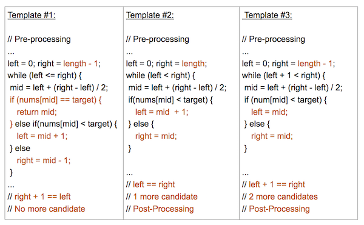

## 二分查找

二分属于**分治思想**，不断地把问题分成两个子问题，直到最后分成一个可直接解决的子问题。前提条件是**有序**。一般时间复杂度中带有`logn`都用到了二分的思想。

### 模板

#### 模板1`（left <= right）`

- `left <= right`也就决定了会遍历到列表中每一个元素。最后结束情况为：`right + 1 == left`，不需要进行后处理。

#### 模板2`(left < right)`

- 保证查找空间在每一步中至少有 2 个元素，即left 和 right 元素。
- 需要进行后处理。当最后只剩下**一个元素**（`left == right`）时循环结束，需要判断 left / right 元素是否符合条件。

#### 模板3`(left + 1 < right)`

- 保证查找空间在每个步骤中至少有 3 个元素，即left, left +1 和 right元素。
- 需要进行后处理。当最后只剩下**两个元素**（`left + 1 == right`）时循环结束，需要判断left 和 right/left + 1元素是否符合条件。

