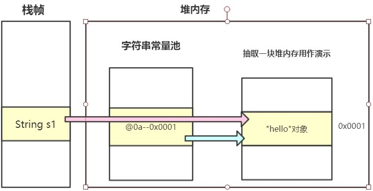
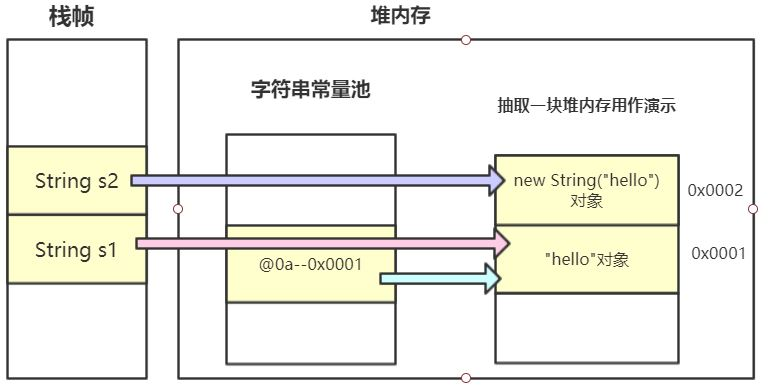
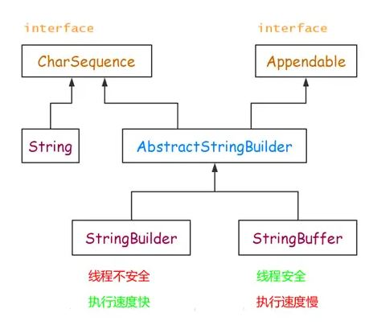

## 字符串笔记

Java中用来存储一个**字符串对象**总共有三种实现方式，分别是`String`类，`StringBuffer`类和`StringBuilder`类，每种方法都有其优缺点和适用场景。如果单纯说存储一个字符串，可以把它看作一个字符数组，那么还可以用`char`数组来实现。
#### `String`和`char`的区别
1. 类型不同：char是字符类型，String是字符串类型
   
   对于这个问题，首先来看一下Java的基本数据类型。Java中总共有两个基本数据类型，**基本数据类型**(Primitive data type)和**引用数据类型**(non-primitive data type)

   * 基本数据类型：byte(1), short(2), int(4), long(8), float(4), double(8), boolean, char(2).

   * 引用数据类型：array, class, interface.
     
     首先`char`属于**基本数据类型**，而`String`属于引用数据类型中的`Class`,其位于`java.lang.String`。`String`类可以调用方法，具有面向对象的特征。
2. String字符串用`'' ''`来包含**串**，而char用`''`来包含**单字符**。
3. `String`与`char数组`的转换。
   * 使用`String.toCharArray()`转`char数组`

   ```java
   String str = "abc";
   char nums[] = str.toCharArray();
   char s = str.charAt(0); //可以使用charAt()获取单个字符
   ```

   * 使用`String.valueOf()`转`String`

   ```java
   char nums[] = {'a','b','c'};
   String str = String.valueOf(nums);
   ```
### `String`类

#### 创建字符串

Java提供了两种方法来生成一个新的字符串对象。

```java
String str1 = "hello";					 //使用双引号/字面量 直接创建
String str2 = new String("hello");		         //通过new关键字创建
```

下面我们来看一下JVM是如何处理新生成字符串的。

首先我们先来讲述一下字符串常量池的概念。

> - 常量池是Java中的一种技术，八种基础数据类型除了float和double都实现了常量池技术. 这项技术从字面上是很好理解的: 把经常用到的数据存放在某块内存中, 避免频繁的数据创建与销毁, 实现数据共享, 提高系统性能。简单来说，可以理解为一种对于**常用数据的cache**。
> - 字符串常量池在每个VM中只有一份，**存放**的是字符串常量的**引用值**。具体的实例对象是在堆中开辟的一块空间存放的。
> - 字符串常量池——string pool，也叫做string literal pool。
> - 在JDK1.7以后，字符串常量池被放到了**堆**中。
> - 字符串常量池是全局共享的。

下面我们用一段代码来展示整个过程。

```java
String s1 = "hello";
String s2 = new String("hello");
System.out.println(s1 == s2);   //false
String s3 = "hello";
System.out.println(s1 == s3);   //true
String s4 = new String("hello");
System.out.println(s2 == s4);   //false
```

- 使用双引号`" "`即字面量方法创建一个字符串。

  > VM会首先到字符串常量池中查找该字符串是否存在：
  >
  > **存在**则**根据引用找到这个堆上的对象**，返回堆上的对象。
  >
  > **不存在**则会在堆上**创建**该字符串**对象**，然后在字符串常量池中**注册添加**该字符串对象的引用，然后**返回**堆上的字符串对象。

  以```String s1 = "hello";```举例。首先在字符串常量池中**没有"hello"**这个字符串对象，于是在堆中创建出“hello”这个字符串对象，然后在字符串常量池中注册并添加"hello"对象的引用，最后变量s1指向堆中的“hello”对象。

  而`"String s3 ="hello"`去字符串常量池中发现有`"hello"`对象的引用，于是直接根据这个引用返回堆中`hello`对象的地址，所以`s1 == s3`为**true**.
  
  


- 使用**new**关键字创建字符串。使用**new**关键字**始终为在堆上新建**一个字符串对象，并把新建的字符串对象返回。

  `String s2`和`String s4`均指向堆上新建的字符串对象，且这两个对象地址并不相同。

  

#### 字符串不可变性

​	String对象被创建后则**不能被修改**，**任何的修改操作都会生成新的对象**。

```java
String s1 = "hello";		//在堆上创建了一个"hello"字符串对象
s1 = "hello" + "world";		//在堆上又创建了一个"hello world"对象，且原来"hello"对象仍在内存中
							//当进行大量修改操作时，会在堆上创建很多个无效对象。
```

#### 常用方法

| 方法                                           | 说明                                                         |
| :--------------------------------------------- | :----------------------------------------------------------- |
| char charAt(int index)                         | 返回指定索引处的char值                                       |
| int compareTo(Object o)                        | 字符串与另一个对象对象（**区分大小写**）。==则返回0，否则返回非0。 |
| int compareToIgnoreCase(Object o)              | 字符串与另一个对象对象（**不区分大小写**）。==则返回0，否则返回非0。 |
| String concat(String str)                      | 把`str`链接到原字符串结尾，返回连接后的字符串                |
| equals(Object o)                               | 将**字符串的值**与**形参的值**进行比较。（注意与 `== `的区分） |
| int indexOf(String str)                        | 返回形参str在字符串中第一次出现的索引                        |
| int length()                                   | 返回字符串长度                                               |
| String substring(int beginIndex, int endIndex) | 返回子字符串                                                 |
| Boolean contains(CharSequence s)               | 是否含有一个子字符串                                         |

#### 与基本数据类型的转化

- 转字符串

  ```java
  int a = 2;
  //1.用String.valueOf()转换
  String str1 = String.valueOf(a);
  //2.用 + ""转换
  String str2 = a + "";
  //3.对应包装类的toString()方法
  String str3 = Integer.toString(a);
  ```

- 转基本数据类型

  ```java
  String str = "2";
  //对应包装类的parsexxx()方法
  int a = Integer.parseInt(str);
  ```

### `StringBuffer`类

前面我们提到了`String`作为一个**不可变对象**，进行修改操作时会创建大量对象，浪费内存；同时由于是常量，不可变，所以**线程安全**。

而`StringBuffer`和`StringBuilder`是**可变对象**（JDK8中其内部实现为一个`char数组`）。

`StringBuffer`是**线程安全**的，其内部实现加上了synchronized关键字。而`StringBuilder`是**线程不安全**的。

### `StringBuilder`类

在正常情况(单线程场景)下，一般推荐使用`StringBuilder`来对字符串进行操作。

```java
StringBuilder str1 = new StringBuilder();			//创建一个空的字符串变量
StringBuilder str2 = new StringBuilder("hello");	//创建一个字符串变量，并赋初值"hello"
StringBuilder str3 = new StringBuilder(100);			//创建一个指定数组大小的字符串变量
```

#### 常用方法

| 方法                                         | 说明                                                   |
| :------------------------------------------- | :----------------------------------------------------- |
| StringBuilder append(CharSequence seq)       | 把形参字符序列链接到当前对象尾部，返回链接后的对象。   |
| String toString()                            | 把StringBuilder对象转为String对象                      |
| StringBuilder insert(int offset, String str) | 在指定下标处插入字符串，并对应移动指定下标后的字符序列 |
| StringBuilder delete(int start, int end)     | 删除字符序列中指定的子序列                             |
| StringBuilder reverse()                      | 将字符序列反转                                         |

#### 三者关系




